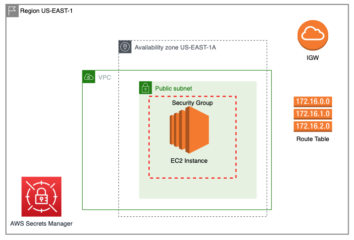
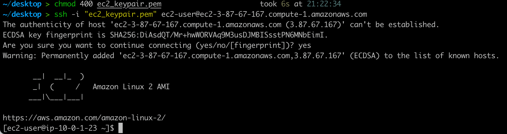

# Challenge 1 - EC2 Instance

* Create a terraform config that will standup an EC2 instance in us-east-1 AZ=A and use the latest Amazon Linux 2 AMI.
* Create an SSH Keypair so you can SSH to the EC2.
* Use A Cloud Guru Playground to test your Terraform Config and provide test evidence showing you can log in using SSH.

# My Solution

* **Create a terraform config that will standup an EC2 instance in us-east-1 AZ=A and use the latest Amazon Linux 2 AMI.**

    _I have created a VPC containing the necessary resources. See the following diagram._

* **Create an SSH Keypair so you can SSH to the EC2.**

    _A pem file is created and stored within AWS Secrets Manager._

* **Use A Cloud Guru Playground to test your Terraform Config and provide test evidence showing you can log in using SSH.**

    _SSH connection to EC2 instance:_

