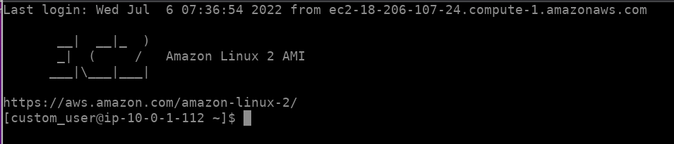
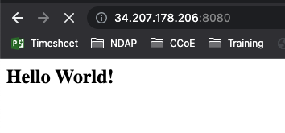

# Challenge 2 - Remote state, Modules, Simple Webpage

* Add a remote backend using S3 and Dynamo DB
* Create a module that creates the EC2 instance. The module will take input value of instance name and the EC2 instance username.
* On the EC2 instance install nginx and create a simple HTML page index.html and configure nginx to display that page on an endpoint using HTTP port 8080

# My Solution

* **Add a remote backend using S3 and Dynamo DB**

    I have created an S3 bucket and DynamoDB table to store the Terraform state files and locks. In order to use the backend, when I initially create the infrastructure the "backend" code block is commented out because the bucket needs to be created before the backend is configured. Once the infrastrucure is created (terraform init, terraform plan, terraform apply), I uncomment the backend code block and run 'terraform init' which will give me the option of using S3 as the backend.

* **Create a module that creates the EC2 instance. The module will take input value of instance name and the EC2 instance username.**

    I set up a modules/ec2 folder structure which contains the terraform module code. Variable input values for EC2 instance name and EC2 username are passed into the module. See below screenshot for evidence of passing in the "custom_user" name that is used to create a new user on the instance. 

    

* **On the EC2 instance install nginx and create a simple HTML page index.html and configure nginx to display that page on an endpoint using HTTP port 8080**

    I have installed nginx on the EC2 instance with specifying user data. See below screenshot for the evidence of a basic HTTP webpage being displayed through port 8080. _I needed to change "HTTPS" to "HTTP" within the browser address bar._

    